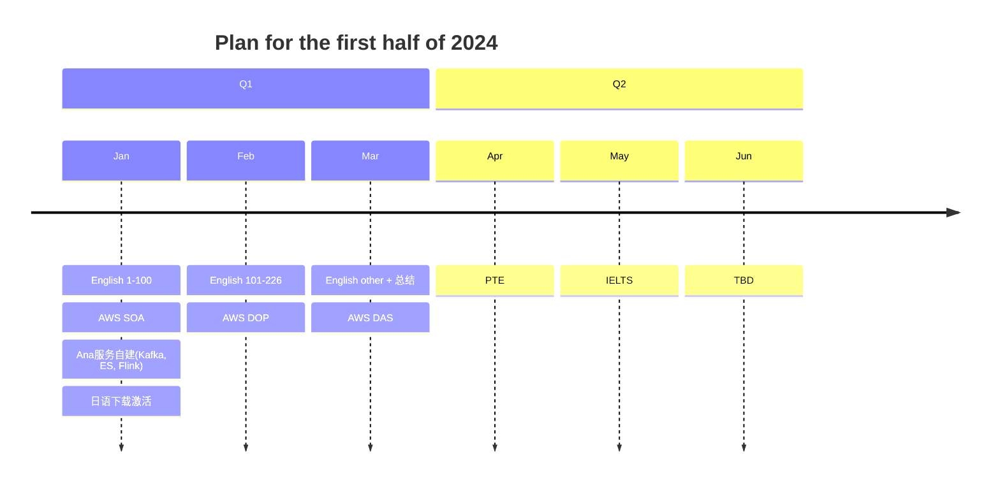
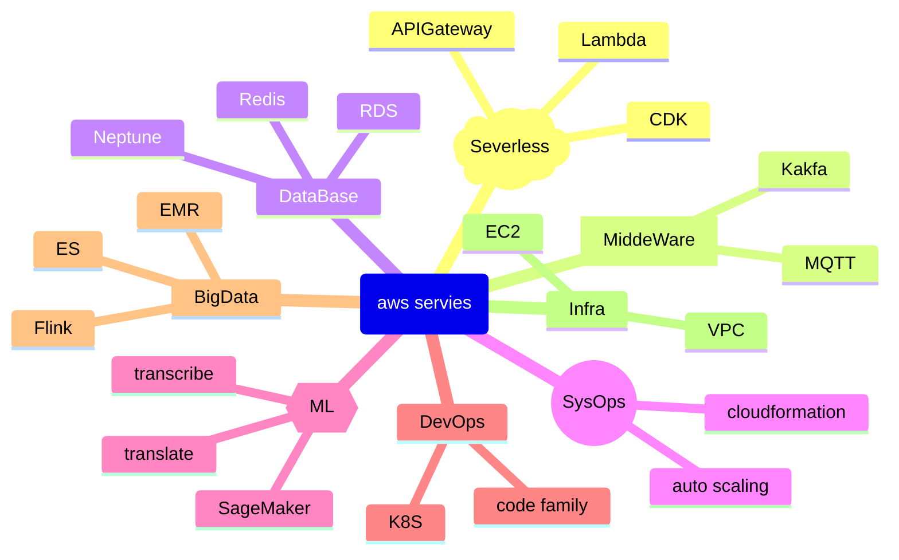
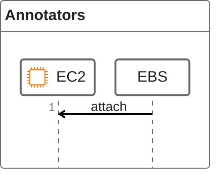

```mermaid
timeline
    title Plan for the first half of 2024
    section Q1
      Jan : English 1-100: AWS SOA: Ana服务自建(Kafka, ES, Flink): 日语下载激活
      Feb : English 101-226: AWS DOP
    	Mar : English other + 总结: AWS DAS
    section Q2
     	Apr : PTE
      May : IELTS
    	Jun : TBD
```

```mermaid
mindmap
root(aws servies)
	)Severless(
		APIGateway
		Lambda
		CDK
	[MiddeWare]
		Kakfa
		MQTT
	DataBase
		RDS
		Neptune
		Redis
	((SysOps))
		auto scaling
		cloudformation
	{{ML}}
		SageMaker
		translate
		transcribe
	DevOps
		K8S
		code family
	BigData
		ES
		EMR
		Flink
	Infra
		EC2
		VPC
		
	
```

```mermaid
zenuml
title Annotators
@EC2 EC2
@EBS EBS
EBS->EC2: attach
```

